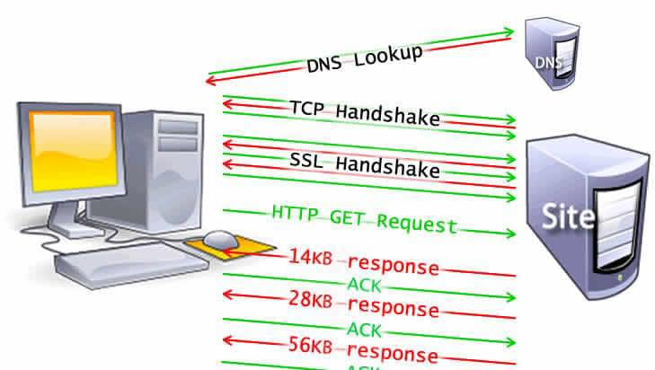
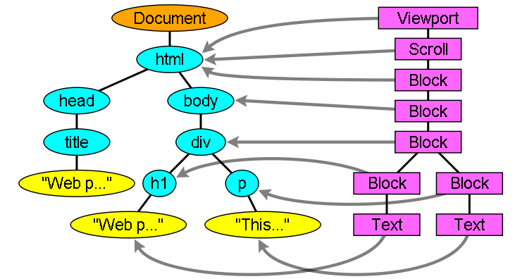

A web browser is an application software for accessing the World Wide
Web or a local website. It retrieves information from other parts of the
web and displays it on your desktop or mobile device.

**Navigation**

*Navigation* is the first step in loading a web page. It occurs whenever
a user requests a page by entering a URL into the address bar, clicking
a link, submitting a form, as well as other actions.

One of the goals of web performance is to minimize the amount of time a
navigation takes to complete. In ideal conditions, this usually doesn\'t
take too long, but latency and bandwidth are foes which can cause
delays.

**DNS Lookup**

The first step of navigating to a web page is finding where the assets
for that page are located. If you navigate to https://example.com, the
HTML page is located on the server with IP address of 93.184.216.34. If
you\'ve never visited this site, a DNS lookup must happen.

Your browser requests a DNS lookup, which is eventually fielded by a
name server, which in turn responds with an IP address. After this
initial request, the IP will likely be cached for a time, which speeds
up subsequent requests by retrieving the IP address from the cache
instead of contacting a name server again.

DNS lookups usually only need to be done once per hostname for a page
load. However, DNS lookups must be done for each unique hostname the
requested page references. If your fonts, images, scripts, ads, and
metrics all have different hostnames, a DNS lookup will have to be made
for each one.

{width="5.343284120734908in"
height="1.8941262029746282in"}

This can be problematic for performance, particularly on mobile
networks. When a user is on a mobile network, each DNS lookup has to go
from the phone to the cell tower to reach an authoritative DNS server.
The distance between a phone, a cell tower, and the name server can add
significant latency.

**TCP Handshake**

Once the IP address is known, the browser sets up a connection to the
server via a TCP three-way handshake. This mechanism is designed so that
two entities attempting to communicate---in this case the browser and
web server---can negotiate the parameters of the network TCP socket
connection before transmitting data, often
over [HTTPS](https://developer.mozilla.org/en-US/docs/Glossary/https).

TCP\'s three-way handshaking technique is often referred to as
\"SYN-SYN-ACK\"---or more accurately SYN, SYN-ACK, ACK---because there
are three messages transmitted by TCP to negotiate and start a TCP
session between two computers. Yes, this means three more messages back
and forth between each server, and the request has yet to be made.

**TLS Negotiation**

For secure connections established over HTTPS, another \"handshake\" is
required. This handshake, or rather
the [TLS](https://developer.mozilla.org/en-US/docs/Glossary/TLS) negotiation,
determines which cipher will be used to encrypt the communication,
verifies the server, and establishes that a secure connection is in
place before beginning the actual transfer of data. This requires three
more round trips to the server before the request for content is
actually sent.

{width="5.059701443569554in"
height="2.860676946631671in"}

While making the connection secure adds time to the page load, a secure
connection is worth the latency expense, as the data transmitted between
the browser and the web server cannot be decrypted by a third party.

After the 8 round trips, the browser is finally able to make the
request.

**Response**

Once we have an established connection to a web server, the browser
sends an initial HTTP GET request on behalf of the user, which for
websites is most often an HTML file. Once the server receives the
request, it will reply with relevant response headers and the contents
of the HTML.

```
\<!doctype HTML\>

\<html\>

\<head\>

\<meta charset=\"UTF-8\"/\>

\<title\>My simple page\</title\>

\<link rel=\"stylesheet\" src=\"styles.css\"/\>

\<script src=\"myscript.js\"\>\</script\>

\</head\>

\<body\>

\<h1 class=\"heading\"\>My Page\</h1\>

\<p\>A paragraph with a \<a
href=\"https://example.com/about\"\>link\</a\>\</p\>

\<div\>

\

\</div\>

\<script src=\"anotherscript.js\"\>\</script\>

\</body\>

\</html\>
```

This response for this initial request contains the first byte of data
received. [Time to First
Byte](https://developer.mozilla.org/en-US/docs/Glossary/time_to_first_byte) (TTFB)
is the time between when the user made the request---say by clicking on
a link---and the receipt of this first packet of HTML. The first chunk
of content is usually 14KB of data.

In our example above, the request is definitely less than 14KB, but the
linked resources aren\'t requested until the browser encounters the
links during parsing, described below.

**TCP Slow Start / 14KB rule**

The first response packet will be 14KB. This is part of [TCP slow
start](https://developer.mozilla.org/en-US/docs/Glossary/TCP_slow_start),
an algorithm which balances the speed of a network connection. Slow
start gradually increases the amount of data transmitted until the
network\'s maximum bandwidth can be determined.

In [TCP slow
start](https://developer.mozilla.org/en-US/docs/Glossary/TCP_slow_start),
after receipt of the initial packet, the server doubles the size of the
next packet to around 28KB. Subsequent packets increase in size until a
predetermined threshold is reached, or congestion is experienced.

{width="3.5074628171478563in"
height="1.9830653980752406in"}

If you\'ve ever heard of the 14KB rule for initial page load, TCP slow
start is the reason why the initial response is 14KB, and why web
performance optimization calls for focusing optimizations with this
initial 14KB response in mind. TCP slow start gradually builds up
transmission speeds appropriate for the network\'s capabilities to avoid
congestion.

**Congestion control**

As the server sends data in TCP packets, the user\'s client confirms
delivery by returning acknowledgements, or ACKs. The connection has a
limited capacity depending on hardware and network conditions. If the
server sends too many packets too quickly, they will be dropped.
Meaning, there will be no acknowledgement. The server registers this as
missing ACKs. Congestion control algorithms use this flow of sent
packets and ACKs to determine a send rate.

**High Level Components of a browser: -**

The browser\'s main components are:

1.  **The user interface**: This includes the address bar, back/forward
    button, bookmarking menu, etc. Every part of the browser display
    except the window where you see the requested page.

2.  **The browser engine**: The browser engine works as a bridge between
    the User interface and the rendering engine. According to the inputs
    from various user interfaces, it queries and manipulates the
    rendering engine.

3.  **The rendering engine**: Responsible for displaying requested
    content. For example, if the requested content is HTML, the
    rendering engine parses HTML and CSS, and displays the parsed
    content on the screen. Different browsers user different rendering
    engines:\
    \* Internet Explorer: Trident\
    \* Firefox & other Mozilla browsers: Gecko\
    \* Chrome & Opera 15+: Blink\
    \* Chrome (iPhone) & Safari: Webkit

4.  **Networking**: For network calls such as HTTP requests, using
    different implementations for different platform behind a
    platform-independent interface. The network component may implement
    a cache of retrieved documents in order to reduce network traffic.

5.  **UI backend**: used for drawing basic widgets like combo boxes and
    windows. This backend exposes a generic interface that is not
    platform specific. Underneath it uses operating system user
    interface methods.

6.  **JavaScript interpreter**. Used to parse and execute JavaScript
    code.

7.  **Data storage**. This is a persistence layer. It is a small
    database created on the local drive of the computer where the
    browser is installed. It manages user data such as cache, cookies,
    bookmarks and preferences.

{width="3.08955271216098in"
height="2.0936154855643045in"}

**Rendering engine and its use: -**

Different browsers use different rendering engines: Internet Explorer
uses Trident, Firefox uses Gecko, Safari uses WebKit. Chrome and Opera
(from version 15) use Blink, a fork of WebKit.

**The Main flow**

The rendering engine will start getting the contents of the requested
document from the networking layer. This is usually done in 8KB chunks.

After that the basic flow of the rendering engine is:

{width="6.246527777777778in"
height="0.6868055555555556in"}

The rendering engine will start parsing the HTML document and convert
elements to DOM nodes in a tree called the **\"content tree\"**.

The engine will parse the style data, both in external CSS files and in
style elements. Styling information together with visual instructions in
the HTML will be used to create another tree: the **render tree**. The
render tree contains rectangles with visual attributes like color and
dimensions. The rectangles are in the right order to be displayed on the
screen.

After the construction of the render tree it goes through
a **\"layout\"** process. This means giving each node the exact
coordinates where it should appear on the screen.

The next stage is **painting**-the render tree will be traversed and
each node will be painted using the UI backend layer.

It\'s important to understand that this is a gradual process. For better
user experience, the rendering engine will try to display contents on
the screen as soon as possible. It will not wait until all HTML is
parsed before starting to build and layout the render tree. Parts of the
content will be parsed and displayed, while the process continues with
the rest of the contents that keeps coming from the network.

Given below is Webkit\'s flow:

{width="4.238805774278215in"
height="1.961353893263342in"}

**Parsing Basics: -**

**Parsing:** Translating the document to a structure the code can use.
The result of parsing is usually a tree of nodes that represent the
structure of the document.

**Grammar:** Parsing is based on the syntax rules the document obeys:
the language or format it was written in. Every format you can parse
must have deterministic grammar consisting of vocabulary and syntax
rules. It is called a **context free grammar**.

Parsing can be separated into two sub processes: lexical analysis and
syntax analysis.

**Lexical analysis:** The process of breaking the input into tokens.
Tokens are the language vocabulary: the collection of valid building
blocks.

**Syntax analysis:** The applying of the language syntax rules.

Parsers usually divide the work between two components: the lexer
(sometimes called tokenizer) that is responsible for breaking the input
into valid tokens, and the parser that is responsible for constructing
the parse tree by analyzing the document structure according to the
language syntax rules. The lexer knows how to strip irrelevant
characters like white spaces and line breaks.

{width="1.0520833333333333in"
height="3.127083333333333in"}

The parsing process is iterative. The parser will usually ask the lexer
for a new token and try to match the token with one of the syntax rules.
If a rule is matched, a node corresponding to the token will be added to
the parse tree and the parser will ask for another token.

If no rule matches, the parser will store the token internally, and keep
asking for tokens until a rule matching all the internally stored tokens
is found. If no rule is found then the parser will raise an exception.
This means the document was not valid and contained syntax errors.

The job of the HTML parser is to parse the HTML markup into a parse
tree. HTML parsing algorithm consists of two stages: tokenization and
tree construction.

**Tokenization** is the lexical analysis, parsing the input into tokens.
Among HTML tokens are start tags, end tags, attribute names and
attribute values. The tokenizer recognizes the token, gives it to the
tree constructor, and consumes the next character for recognizing the
next token, and so on until the end of the input.

{width="3.2090277777777776in"
height="4.163888888888889in"}

**DOM Tree**

The output tree (the \"parse tree\") is a tree of DOM element and
attribute nodes. DOM is short for Document Object Model. It is the
object presentation of the HTML document and the interface of HTML
elements to the outside world like JavaScript. The root of the tree is
the \"Document\" object.

The DOM has an almost one-to-one relation to the markup. For example:

```
**\<html\>**

**\<body\>**

**\<p\>**

**Hello World**

**\</p\>**

**\<div\> \\</div\>**

**\</body\>**

**\</html\>**
```

This markup would be translated to the following DOM tree:

{width="4.163888888888889in"
height="2.283333333333333in"}

**CSS Parsing**

CSS Selectors are matched by browser engines from right to left. Keep in
mind that when a browser is doing selector matching it has one element
(the one it\'s trying to determine style for) and all your rules and
their selectors and it needs to find which rules match the element. This
is different from the usual jQuery thing, say, where you only have one
selector and you need to find all the elements that match that selector.

Why does the CSSOM have a tree structure? When computing the final set
of styles for any object on the page, the browser starts with the most
general rule applicable to that node (e.g. if it is a child of body
element, then all body styles apply) and then recursively refines the
computed styles by applying more specific rules - i.e. the rules
"cascade down".

**Render Tree**

While the DOM tree is being constructed, the browser constructs another
tree, the render tree. This tree is of visual elements in the order in
which they will be displayed. It is the visual representation of the
document. The purpose of this tree is to enable painting the contents in
their correct order.

A renderer knows how to lay out and paint itself and its children. Each
renderer represents a rectangular area usually corresponding to a
node\'s CSS box.

**Render tree\'s relation to the DOM tree**

The renderers correspond to DOM elements, but the relation is not one to
one. Non-visual DOM elements will not be inserted in the render tree. An
example is the \"head\" element. Also elements whose display value was
assigned to \"none\" will not appear in the tree (whereas elements with
\"hidden\" visibility will appear in the tree).

There are DOM elements which correspond to several visual objects. These
are usually elements with complex structure that cannot be described by
a single rectangle. For example, the \"select\" element has three
renderers: one for the display area, one for the drop down list box and
one for the button. Also when text is broken into multiple lines because
the width is not sufficient for one line, the new lines will be added as
extra renderers.

Some render objects correspond to a DOM node but not in the same place
in the tree. Floats and absolutely positioned elements are out of flow,
placed in a different part of the tree, and mapped to the real frame. A
placeholder frame is where they should have been.

{width="6.077270341207349in"
height="3.292201443569554in"}

In WebKit the process of resolving the style and creating a renderer is
called \"attachment\". Every DOM node has an \"attach\" method.
Attachment is synchronous, node insertion to the DOM tree calls the new
node \"attach\" method.

Building the render tree requires calculating the visual properties of
each render object. This is done by calculating the style properties of
each element. The style includes style sheets of various origins, inline
style elements and visual properties in the HTML (like the \"bgcolor\"
property). The latter is translated to matching CSS style properties.

**The order of processing scripts and style sheets: -**

**Scripts **

The model of the web is synchronous. Authors expect scripts to be parsed
and executed immediately when the parser reaches a \<script\> tag. The
parsing of the document halts until the script has been executed. If the
script is external then the resource must first be fetched from the
network - this is also done synchronously, and parsing halts until the
resource is fetched. This was the model for many years and is also
specified in HTML4 and 5 specifications. Authors can add the \"defer\"
attribute to a script, in which case it will not halt document parsing
and will execute after the document is parsed. HTML5 adds an option to
mark the script as asynchronous so it will be parsed and executed by a
different thread.

**Speculative parsing**

Both WebKit and Firefox do this optimization. While executing scripts,
another thread parses the rest of the document and finds out what other
resources need to be loaded from the network and loads them. In this
way, resources can be loaded on parallel connections and overall speed
is improved. Note: the speculative parser only parses references to
external resources like external scripts, style sheets and images: it
doesn\'t modify the DOM tree - that is left to the main parser.

**Style sheets **

Style sheets on the other hand have a different model. Conceptually it
seems that since style sheets don\'t change the DOM tree, there is no
reason to wait for them and stop the document parsing. There is an
issue, though, of scripts asking for style information during the
document parsing stage. If the style is not loaded and parsed yet, the
script will get wrong answers and apparently this caused lots of
problems. It seems to be an edge case but is quite common. Firefox
blocks all scripts when there is a style sheet that is still being
loaded and parsed. WebKit blocks scripts only when they try to access
certain style properties that may be affected by unloaded style sheets.

**Layout: -**

When the renderer is created and added to the tree, it does not have a
position and size. Calculating these values is called layout or reflow.

HTML uses a flow-based layout model, meaning that most of the time it is
possible to compute the geometry in a single pass. Elements later \'in
the flow\' typically do not affect the geometry of elements that are
earlier \'in the flow\', so layout can proceed left-to-right,
top-to-bottom through the document. The coordinate system is relative to
the root frame. Top and left coordinates are used.

Layout is a recursive process. It begins at the root renderer, which
corresponds to the element of the HTML document. Layout continues
recursively through some or all of the frame hierarchy, computing
geometric information for each renderer that requires it.

The position of the root renderer is 0,0 and its dimensions are the
viewport--the visible part of the browser window. All renderers have a
\"layout\" or \"reflow\" method, each renderer invokes the layout method
of its children that need layout.

In order not to do a full layout for every small change, browsers use a
\"dirty bit\" system. A renderer that is changed or added marks itself
and its children as \"dirty\": needing layout. There are two flags:
\"dirty\", and \"children are dirty\" which means that although the
renderer itself may be OK, it has at least one child that needs a
layout.

The layout usually has the following pattern:

- Parent renderer determines its own width.

- Parent goes over children and:

  - Place the child renderer (sets its x and y).

  - Calls child layout if needed--they are dirty or we are in a
    global layout, or for some other reason--which calculates the
    child\'s height.

- Parent uses children\'s accumulative heights and the heights of
  margins and padding to set its own height--this will be used by the
  parent renderer\'s parent.

- Sets its dirty bit to false.

Also note, layout thrashing is where a web browser has to reflow or
repaint a web page many times before the page is 'loaded'. In the days
before JavaScript's prevalence, websites were typically reflowed and
painted just once, but these days it is increasingly common for
JavaScript to run on page load which can cause modifications to the DOM
and therefore extra reflows or repaints. Depending on the number of
reflows and the complexity of the web page, there is potential to cause
significant delay when loading the page, especially on lower powered
devices such as mobile phones or tablets.

**Painting: -**

In the painting stage, the render tree is traversed and the renderer\'s
\"paint()\" method is called to display content on the screen. Painting
uses the UI infrastructure component.

Like layout, painting can also be global--the entire tree is painted--or
incremental. In incremental painting, some of the renderers change in a
way that does not affect the entire tree. The changed renderer
invalidates its rectangle on the screen. This causes the OS to see it as
a \"dirty region\" and generate a \"paint\" event. The OS does it
cleverly and coalesces several regions into one.

Before repainting, WebKit saves the old rectangle as a bitmap. It then
paints only the delta between the new and old rectangles. The browsers
try to do the minimal possible actions in response to a change. So
changes to an elements color will cause only repaint of the element.
Changes to the element position will cause layout and repaint of the
element, its children and possibly siblings. Adding a DOM node will
cause layout and repaint of the node. Major changes, like increasing
font size of the \"html\" element, will cause invalidation of caches,
relayout and repaint of the entire tree.

There are three different positioning schemes:

- **Normal:** the object is positioned according to its place in the
  document. This means its place in the render tree is like its place
  in the DOM tree and laid out according to its box type and
  dimensions

- **Float:** the object is first laid out like normal flow, then moved
  as far left or right as possible

- **Absolute:** the object is put in the render tree in a different
  place than in the DOM tree

The positioning scheme is set by the \"position\" property and the
\"float\" attribute.

- static and relative cause a normal flow

- absolute and fixed cause absolute positioning

In static positioning no position is defined and the default positioning
is used. In the other schemes, the author specifies the position: top,
bottom, left, right.

**Layers** are specified by the z-index CSS property. It represents the
third dimension of the box: its position along the \"z axis\".

The boxes are divided into stacks (called stacking contexts). In each
stack the back elements will be painted first and the forward elements
on top, closer to the user. In case of overlap the foremost element will
hide the former element. The stacks are ordered according to the z-index
property. Boxes with \"z-index\" property form a local stack.
